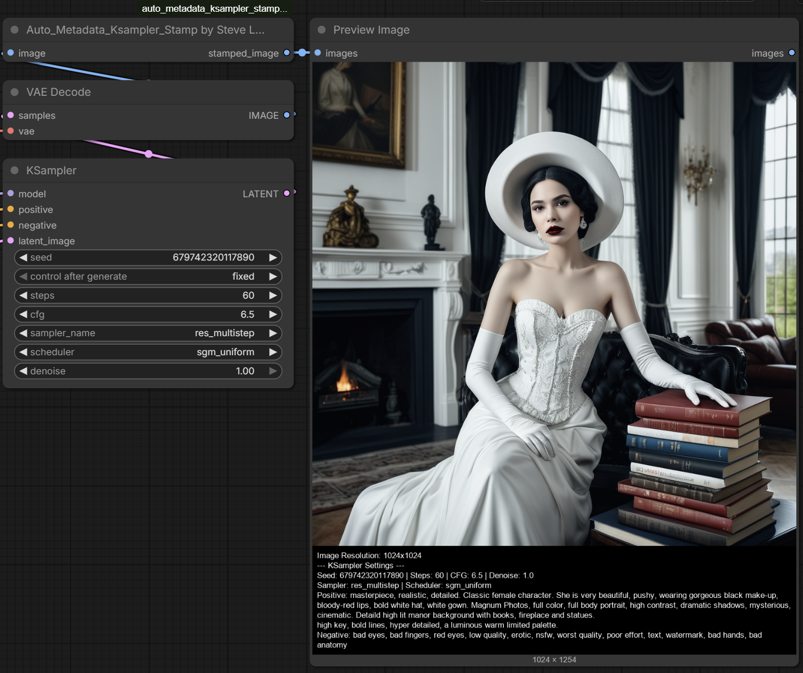

# Auto_Metadata_Ksampler_Stamp by Steve Lasmin

A **ComfyUI custom node** that automatically extracts **KSampler metadata** from your workflow JSON and stamps it onto the bottom of your generated image as clean, readable text.



---

## What It Does

Ever wanted to know exactly what settings and prompts were used to generate an image — without digging through the workflow JSON? This node does it automatically:

- **Captures the full workflow** via ComfyUI's hidden `PROMPT` input
- **Finds all KSampler nodes** in your workflow (including `KSampler`, `KSamplerAdvanced`, `KSampler (Efficient)`, and many custom variants)
- **Traces prompt connections** back to `CLIPTextEncode` nodes to retrieve the actual positive and negative prompts
- **Stamps metadata** onto a black padding bar at the bottom of the image with white text

### Metadata Extracted

- **Image Resolution**
- **Seed**, **Steps**, **CFG**, **Denoise**
- **Sampler** and **Scheduler** names
- **Positive Prompt**
- **Negative Prompt**

Works with **multiple KSamplers** in a single workflow — each one gets its own labeled section.

---

## Installation

### Method 1: Git Clone (Recommended)

```bash
cd ComfyUI/custom_nodes
git clone https://github.com/Eklipsis/auto_metadata_ksampler_stamp_by_steve_lasmin.git
```

Restart ComfyUI.

### Method 2: Manual Download

1. Download the [latest release](https://github.com/Eklipsis/auto_metadata_ksampler_stamp_by_steve_lasmin/releases)
2. Extract the folder into `ComfyUI/custom_nodes/`
3. Restart ComfyUI

### Requirements

- **ComfyUI** (any recent version)
- **Pillow** (usually already installed with ComfyUI)
- No additional Python dependencies required

---

## Usage

1. Add the node: **image/stamping** → **Auto_Metadata_Ksampler_Stamp by Steve Lasmin**
2. Connect your `IMAGE` output from a VAE Decode or Save Image Preview node
3. The node will automatically read the workflow metadata and stamp it onto the image
4. Connect the output to a `Save Image` node or preview it directly

> **Note:** The node uses the hidden `PROMPT` input (provided automatically by ComfyUI) to access the workflow JSON. No manual configuration needed.

---

## Supported Samplers

The node detects and extracts metadata from:

- `KSampler`
- `KSamplerAdvanced`
- `KSampler (Efficient)`
- `KSampler SDXL`, `KSampler Tiled`, `KSampler Inpaint`
- `SamplerCustom`, `SamplerEuler`, `SamplerEulerAncestral`
- `SamplerDPMPP2M`, `SamplerDPMPP2SAncestral`, `SamplerDPMPPSDE`
- And any custom node whose class name **starts with `KSampler`**

Also supports **SDXL dual-text encoders** (`text_g` / `text_l`) and conditioning mix nodes.

---

## Credits

- **Author:** Steve Lasmin (Eklipsis)
- **GitHub:** [https://github.com/Eklipsis](https://github.com/Eklipsis)
- **Support:** [https://boosty.to/stevelasmin](https://boosty.to/stevelasmin)
- **Email:** real.eclipse@gmail.com

If you find this node useful, consider supporting development on [Boosty](https://boosty.to/stevelasmin)!

---

## License

```
Free to use for personal and commercial purposes.
Modification, redistribution of modified versions, or inclusion in
other projects without explicit written approval from the author
is strictly prohibited.

Copyright (c) 2026 Steve Lasmin. All rights reserved.
```

---

## Changelog

### v1.0.1
- Fixed false-positive KSampler detection (removed overly broad "Sampler" string match)
- Added validation: real KSamplers must have `steps` and `cfg` inputs
- Updated all repo links to live GitHub URL
- Added `pyproject.toml` Comfy Registry metadata
- Added `.comfyignore` for clean registry publishing

### v1.0.0
- Initial release
- Automatic KSampler detection and metadata extraction
- Multi-sampler workflow support
- SDXL dual-text encoder support
- Dynamic font scaling and word-wrapping
- Cross-platform font fallback (Windows, Linux, macOS)
